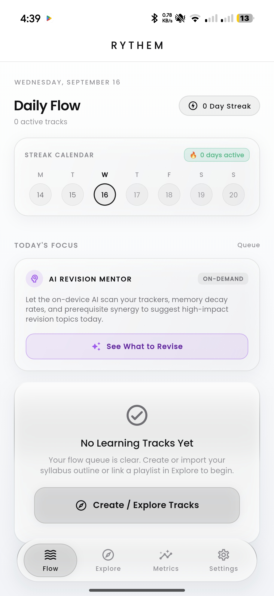
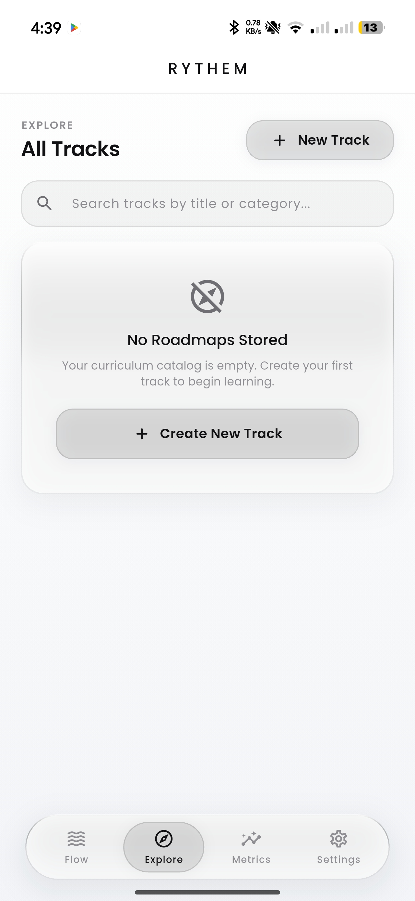
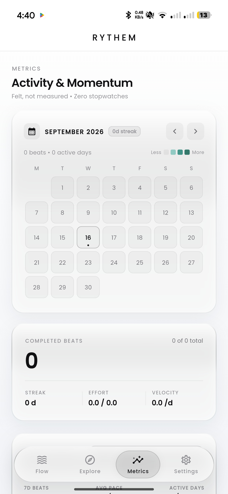
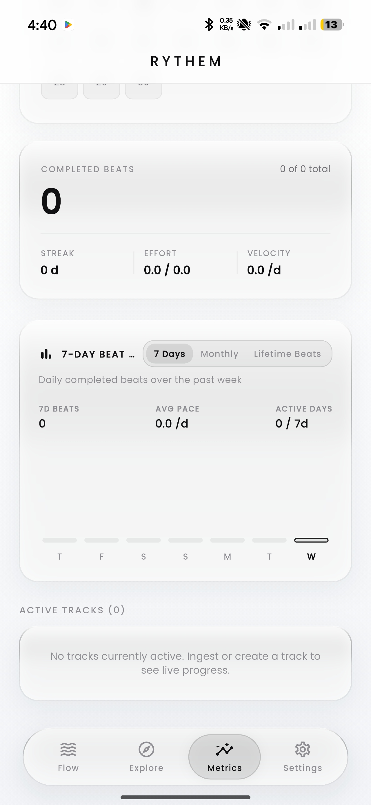
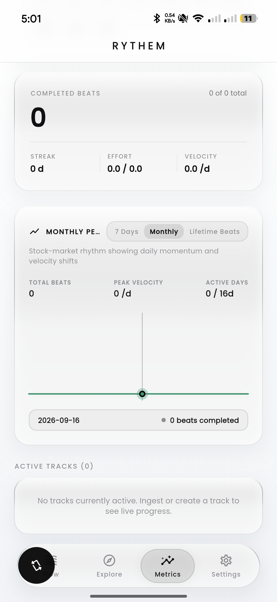
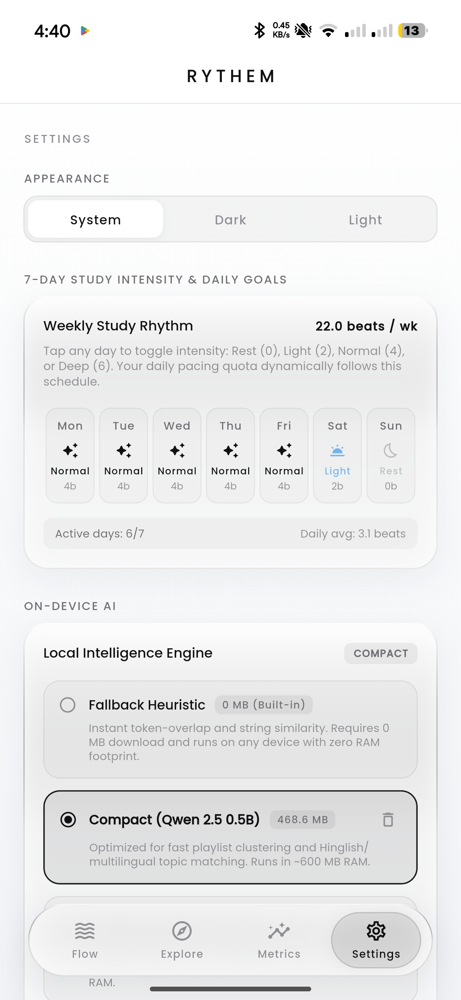

<div align="center">

# 🎵 Rythem
### The Local-First Learning Operating System & Milestone Pacing Tracker

[](https://github.com/ImSurajx/rythem-app/releases/latest)
[](https://flutter.dev)
[](https://dart.dev)
[](https://polyformproject.org/licenses/noncommercial/1.0.0)
[](#private-offline-ai-architecture)
[](https://sqlite.org)

**Beats over clocks. Milestones over stopwatches. Progress felt, not measured.**

[Key Features](#-key-features) •
[App Walkthrough](#-how-to-operate-the-app) •
[Format Syllabus with GPT](#-how-to-format--import-any-syllabus-using-gpt) •
[Screenshots](#-visual-showcase--screenshots) •
[Architecture](#-technical-architecture) •
[Contributing](#-contributing)

</div>

---

## 🌟 Why Rythem?

Traditional study trackers trap learners in anxiety: toxic countdown timers, overdue warning banners, arbitrary hour quotas, and rigid schedules that collapse the moment life happens.

**Rythem redesigns self-directed learning from first principles:**

- ⏱️ **Zero Stopwatches**: No minute or hour counting anywhere in the UI. Work is measured in atomic **Beats** (lessons, exercises, topics).
- 🌊 **Dynamic Pacing Dilution**: Missed a day or fell behind? Rythem never shames you. It mathematically redistributes remaining effort across your target completion date.
- 🧘 **Evening Unlock**: Complete your daily quota and Rythem locks into a psychological rest state. Rest without guilt.
- 🧠 **100% Private On-Device AI**: Powered by local Small Language Models (Qwen 2.5 0.5B and 1.5B GGUF) for instant concept breakdown, shortfall remediation, and active recall without sending data to the cloud.
- 💎 **Liquid Glass Aesthetics**: Liquid monochrome frosted glass design system engineered for 60/120 FPS fluid rendering.

---

## ✨ Key Features

| Feature | Description |
| :--- | :--- |
| **Milestone Pacing Engine** | Pure mathematical pacing that dynamically balances daily effort quotas based on your custom 7-day study rhythm (Rest, Light, Normal, Deep). |
| **YouTube Playlist Ingestion** | One-tap extraction of YouTube playlists (from 10 to 230+ videos) with automatic clustering into structured chapters and deep-linked video timestamps. |
| **Syllabus Outline Ingestion** | Ingest Markdown syllabi, academic curricula, or textbook tables of contents. Automatically aligns mentor videos with course topics. |
| **"Mentor's Flow is King"** | Non-syllabus bonus topics covered by creators are preserved in-place with `Mentor Extra` badges—never deleted or tossed into orphaned bins. |
| **Private AI Mentorship** | Offline pedagogical assistant explaining challenging concepts, diagnosing lag causes, and recommending spaced revisions. |
| **Full Month Habit Calendar** | Interactive GitHub-style contribution heat map tracking daily beat completions with honest streak calculations. |
| **Stock-Market Velocity Chart** | Financial-style momentum graphs displaying daily velocity fluctuations, peak performance days, and cumulative lifetime curves. |
| **Air-Gapped Data Safety** | Embedded SQLite architecture with transactional cascades, foreign-key safety, and full JSON state backup and restore. |

---

## 📱 How to Operate the App

### 1. Onboarding & Study Rhythm Calibration
Upon launching Rythem:
- **Calibrate Your Pace**: Choose your default study pace (**Default Balanced** at ~22 beats/wk, **Accelerated**, or **Gentle**).
- **Select Offline AI Tier**: Choose between **Compact Mentor** (Qwen 2.5 0.5B, ~468MB for low RAM) or **Balanced Mentor** (Qwen 2.5 1.5B, ~1.04GB). Rythem downloads weights seamlessly in the background with automatic heuristic fallbacks.

### 2. Creating or Ingesting Learning Tracks
Navigate to the **Explore** tab to create a track:
- **Paste YouTube Playlist**: Enter any public YouTube playlist URL. Rythem extracts video titles and clusters them into 4–8 organized chapters.
- **Import Syllabus Markdown**: Paste your course outline. Rythem parses chapters, topics, and milestones instantly.
- **Resource Linking**: Tap any beat to attach documentation links, video URLs, or custom notes.

### 3. Conquering Your Daily Flow
Navigate to the **Flow** tab:
- **Daily Mission**: Focus on today’s curated beats matching your target completion date and effort budget.
- **One-Tap Completion**: Tap checkmarks with tactile haptic feedback.
- **Evening Unlock**: Once your quota is reached, Rythem celebrates with an evening rest confirmation.
- **Spaced Revision**: Open the Daily Revision Board for active recall prompts tailored to your forgetting curve.

### 4. Analyzing Momentum & Velocity
Navigate to the **Metrics** tab:
- **Full Month Calendar**: Review your monthly streak heat tiles. Tap any day to inspect completed beats.
- **7-Day Beat Rhythm**: Review bar charts showing daily completed beats over the past week.
- **Monthly Stock Chart**: Track peaks and valleys in learning velocity.
- **Lifetime Curve**: Watch your cumulative completed beats climb.

### 5. Settings & Disaster Recovery
Navigate to the **Settings** tab:
- **Weekly Rhythm Schedule**: Customize target intensities for each day of the week (Mon–Sun): Rest (0b), Light (2b), Normal (4b), or Deep (6b).
- **Full Backup & Restore**: Export your entire database (tracks, chapters, beats, streak history, settings) into a single `.json` file or restore from a backup anytime.

---

## 🤖 How to Format & Import Any Syllabus Using GPT

You can convert any textbook table of contents, university course outline, certification guide, or curriculum into Rythem in seconds using ChatGPT, Claude, or any LLM.

### 📋 The Master Prompt

Copy and paste the following prompt into ChatGPT or Claude, followed by your raw syllabus or course outline:

```markdown
You are an expert curriculum formatter for the Rythem learning app. 
Please convert the following course outline into clean, valid Markdown using this strict structure:

RULES:
1. Each major module or chapter must start with a level-1 heading: `# Chapter Name`
2. Each individual lesson, topic, or milestone must be an unordered list item: `- Topic Title`
3. Optional: Add estimated effort weight in brackets `[Effort: X]` where X is 0.5 (quick review), 1.0 (standard lesson), 2.0 (in-depth lecture), or 3.0 (capstone / challenging exercise). Default is 1.0.
4. Optional: If you have URLs, add them in parentheses: `- Topic Title [Effort: 1.0] (https://...)`
5. Do not include introductory text, conversational pleasantries, or code wrappers—output pure Markdown only.

RAW SYLLABUS:
[PASTE YOUR SYLLABUS, COURSE TOPICS, OR TABLE OF CONTENTS HERE]
```

---

### 💡 Example Output

```markdown
# 1. Mathematical Foundations & Vector Calculus
- Linear Algebra: Vectors, Spaces & Transformations [Effort: 1.0]
- Matrix Multiplication & Eigenvalues [Effort: 1.5]
- Multivariate Derivatives & Gradients [Effort: 1.0]
- The Chain Rule & Vectorized Backpropagation [Effort: 2.0]

# 2. Deep Neural Architectures
- Multilayer Perceptrons & Activation Functions [Effort: 1.0]
- Loss Functions: Cross-Entropy vs MSE [Effort: 1.0]
- Optimization Algorithms: Adam, RMSprop & SGD [Effort: 1.5]
- Batch Normalization & Dropout Regularization [Effort: 1.5]

# 3. Convolutional Networks & Vision
- 2D Convolutions, Kernels & Feature Maps [Effort: 1.0]
- Pooling Layers & Translation Invariance [Effort: 0.5]
- Classic Architectures: ResNet & EfficientNet [Effort: 2.0]

# 4. Sequence Modeling & Attention
- Recurrent Neural Networks & Vanishing Gradients [Effort: 1.5]
- LSTM and GRU Gated Architectures [Effort: 1.5]
- Scaled Dot-Product Attention Mechanisms [Effort: 2.0]
- Multi-Head Attention & The Transformer Architecture [Effort: 3.0]
```

### 📥 Importing into Rythem:
1. Copy the formatted Markdown output.
2. Open Rythem and tap **Explore** -> **Add Track** -> **Import Syllabus Outline**.
3. Enter a Track Title, set your Target Completion Date, paste the Markdown, and tap **Create Learning Track**.

---

## 📸 Visual Showcase & Screenshots

<div align="center">

| Daily Flow (Mission & Rest) | Explore & Chaptering | Metrics & Habit Heatmap |
| :---: | :---: | :---: |
|  |  |  |

| 7-Day Rhythm Bar Chart | Stock-Market Momentum | Settings & Weekly Schedule |
| :---: | :---: | :---: |
|  |  |  |

</div>

> *Tip: To update screenshots, place your device captures inside `assets/screenshots/` with the corresponding filenames.*

---

## 🏗️ Technical Architecture

Rythem is engineered with clean layered architecture:

```
┌─────────────────────────────────────────────────────────────┐
│                       PRESENTATION LAYER                    │
│   FlowScreen  │  ExploreScreen  │  MetricsScreen  │ Settings│
│        (Liquid Glass Design System · Repaint Boundaries)    │
└──────────────────────────────┬──────────────────────────────┘
                               │
┌──────────────────────────────▼──────────────────────────────┐
│                    IN-FLIGHT SYNC PIPELINE                  │
│       Optimistic Toggle Registry · Debounced DB Reload       │
└──────────────────────────────┬──────────────────────────────┘
                               │
┌──────────────────────────────▼──────────────────────────────┐
│                        DOMAIN ENGINES                       │
│    PacingService    │   RevisionService   │ IngestionEngine │
│  (Effort Dilution)  │  (Forgetting Curve) │(YouTube/Markdown)│
└──────────────────────────────┬──────────────────────────────┘
                               │
┌──────────────────────────────▼──────────────────────────────┐
│                     LOCAL INTELLIGENCE                      │
│        LocalInferenceService (Qwen 2.5 0.5B / 1.5B GGUF)    │
└──────────────────────────────┬──────────────────────────────┘
                               │
┌──────────────────────────────▼──────────────────────────────┐
│                      PERSISTENCE LAYER                      │
│           Embedded SQLite (Foreign Keys Cascade ON)         │
│    RoadmapRepo · ChapterRepo · BeatRepo · BeatLogRepo       │
└─────────────────────────────────────────────────────────────┘
```

Detailed architectural blueprints, reactive loops, and module specifications can be found in [.agents/ARCHITECTURE.md](.agents/ARCHITECTURE.md).

---

## 🛠️ Building & Running Locally

### Prerequisites
- [Flutter SDK](https://flutter.dev/docs/get-started/install) (3.x stable)
- Android Studio / Xcode (with command line tools)
- Java 17 (recommended for Android Gradle builds)

### Quickstart

```bash
# 1. Clone the repository
git clone https://github.com/ImSurajx/rythem-app.git
cd rythem-app

# 2. Fetch dependencies
flutter pub get

# 3. Verify static analysis
flutter analyze

# 4. Run automated test suites (123+ tests)
flutter test

# 5. Launch the app in debug mode
flutter run
```

---

## 🤝 Contributing

Contributions are warmly welcome! To maintain software quality and release reliability, please follow these guidelines:

1. **Fork and Branch**: Create a descriptive feature branch (`feat/smart-clustering` or `fix/calendar-touch`).
2. **Follow Code Guidelines**:
   - Adhere to the established liquid glass design system and color tokens (`RythemColors`).
   - Run `flutter analyze` to ensure zero warnings or errors.
   - Run `flutter test` to ensure all existing and new test suites pass.
3. **Signed Commits**: Always sign off your git commits using `git commit -s`.
4. **Update Changelog**: Document user-facing additions or fixes in [CHANGELOG.md](CHANGELOG.md).
5. **Open a Pull Request**: Submit your PR with a clear summary of changes and verification evidence.

---

## 📄 License

This project is licensed under the PolyForm Noncommercial License 1.0.0 - see the [LICENSE](LICENSE) file for details.

---

## 🔍 SEO & Search Discovery Overview

<!-- SEO Meta Description: Local-first milestone study tracker, pacing OS, syllabus progress planner, habit streak calendar, spaced repetition revision, and offline AI learning assistant. -->

**Rythem** is an open-source, local-first **learning operating system**, **study pacing tracker**, and **curriculum planner** engineered for self-directed learners, students, developers, and researchers. Unlike conventional study timers and pomodoro stopwatches, Rythem uses **milestone-driven pacing** and **dynamic dilution** to calculate realistic daily study quotas without stress or toxic overdue banners. Features include:

- **Syllabus & Course Tracker**: Import academic syllabi, textbook tables of contents, and exam outlines in Markdown format.
- **YouTube Playlist Course Ingestion**: Batch convert 100+ to 230+ video playlists into structured chapters and trackable learning beats.
- **Milestone Habit Streak Calendar**: Track daily consistency with GitHub-style contribution heat maps and honest streak counting.
- **Offline On-Device AI Mentor**: Local Small Language Model (SLM) intelligence with zero telemetry or subscription fees.
- **Spaced Repetition & Revision System**: Forgetting curve memory retention recommendations with active recall prompts.
- **Stock-Market Learning Velocity Graph**: Interactive financial-style momentum line charts tracking daily learning trends.
- **100% Air-Gapped Local Storage**: Secure SQLite database with full JSON export, backup, and restore capabilities.

