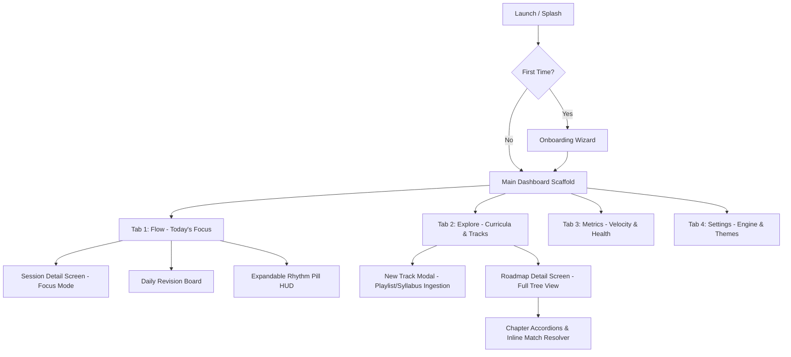
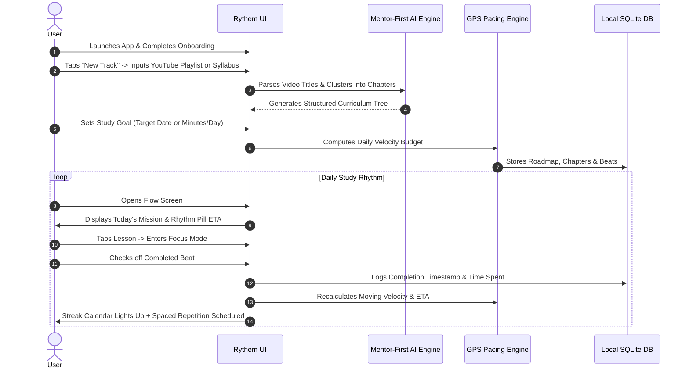

# Rythem: Complete Product Overview, Architecture & User Flow Guide

> **Version**: 1.0.2-pre  
> **Product Category**: Local-First Autonomous Curriculum Engine & Study Pacer  
> **Design Philosophy**: Liquid Glass & Ambient Aurora (VisionOS-inspired specular glassmorphism)  
> **Target Audience**: Self-directed students, software engineers, and autodidacts mastering large curricula (e.g., DSA, Computer Science degrees, System Design, AI/ML, languages) without burnout or backlog anxiety.

---

## 1. Executive Summary: What is Rythem?

**Rythem** is a local-first, privacy-focused curriculum tracker and intelligent pacing assistant. Unlike standard todo apps (which treat studying like static checklists) or flashcard apps (which only test recall), Rythem acts like an **autonomous personal academic mentor with a GPS speedometer**:

1. **Ingests Real-World Media**: It imports entire college syllabi, YouTube video playlists (even 200+ video mega-courses), markdown roadmaps, and textbooks into structured chapters and bite-sized learning lessons ("Beats").
2. **Mentor-First Alignment**: It preserves the mentor's actual teaching order while using an on-device NLP engine to align topics, detect curriculum gaps, and de-duplicate concepts.
3. **Adaptive GPS Pacing (Zero Backlog Debt)**: If you miss a day, Rythem doesn't punish you with red alerts or an overwhelming 50-item overdue pile. Instead, like a GPS recalculating an ETA when you miss an exit, it redistributes remaining study minutes and suggests realistic finish dates.
4. **Built-in Spaced Repetition**: Features an automatic retention shelf (1, 3, 7, 14, 30 days) that prompts quick revisions right on your daily dashboard.
5. **Local-First & Offline**: Powered by on-device SQLite, optional on-device GGUF LLMs (MiniCPM / Gemma), zero cloud tracking, and automated offline JSON/SQLite backups.
6. **Liquid Glass Aesthetic**: A dark, luminous UI with ambient aurora backlighting, specular highlights, dynamic track signatures, and buttery 120Hz/60Hz animations.

---

## 2. Complete Screen-by-Screen UI Anatomy

Rythem is anchored by a persistent, floating frosted glass dock with 4 primary destinations, accompanied by sleek contextual glass sheets.



---

### Tab 1: Flow Screen (`FlowScreen`) — *The Daily Command Center*
The Flow screen is the home screen users visit multiple times a day. It is designed to answer one question immediately: **"What should I study right now, and am I on pace?"**

#### UI Elements & Widgets:
1. **Top Floating Frosted Header**:
   - Displays the brand mark `RYTHEM` with specular top reflection.
   - Shows active sync status, backup indicator, and quick track switcher chip (`Tracks (N)`).
2. **Active Roadmap Header & Title**:
   - Displays current track name, active track count, and signature track glow dot.
3. **7-Day Interactive Streak Calendar (`_FlowStreakCalendar`)**:
   - Displays the current week (Monday to Sunday) with today highlighted in white.
   - **Luminous Day Discs**: Days with completed study sessions glow with the active theme color (e.g., Electric Cyan or Emerald).
   - **Horizontal Swipe Gesture**: Swipe left/right to view past study weeks or tap `TODAY` to snap back.
   - **Streak Flame Pill**: Displays active study streak with a warm solar amber flame (`🔥 N days active`).
4. **Expandable Rhythm Pill HUD (`FlowRhythmPill`)**:
   - A floating glass pill calculating real-time academic velocity.
   - **Collapsed State**: Displays whether the user is `ON TRACK` (emerald glass), `PACE ADAPTED` (amber glass), or `OPEN PACE`. Shows remaining days and daily target (e.g., `45m / day`).
   - **Expanded State (Tap to expand)**: Slides open to reveal complete GPS telemetry:
     - Predicted Completion Date vs Target Deadline.
     - Required Daily Velocity (minutes/day) vs Actual 7-Day Moving Velocity.
     - Catch-up actions (`Adjust Target Date`, `Split Heavy Tasks`, `Study Ahead`).
5. **Daily Revision Board (`DailyRevisionBoard`)**:
   - Shows topics scheduled for spaced repetition review today.
   - Includes quick-action cards with `Revised` checkmarks, `Reschedule`, and `Unshelf` actions.
6. **Track Todo List Cards (`_TrackTodoListCard`)**:
   - **No Artificial Gating**: Shows the complete, unabridged roadmap for active tracks grouped cleanly by chapter.
   - **Signature Track Auras**: Each card has a subtle border glow and accent dot matched to the track's subject (Emerald for Python, Cyan for DSA, Violet for AI, Coral for Frontend, Amber for System Design).
   - **Interactive Checkboxes**: Tap to mark a beat complete with immediate haptic response.
   - **Beat Actions**: Tap any lesson to launch **Session Focus Mode**, or long-press/open action sheet to mark confusing, split into parts, or delay.

---

### Tab 2: Explore Screen (`ExploreScreen`) — *Curricula & Roadmaps*
The Explore tab is where users manage, create, and organize their learning curricula.

#### UI Elements & Widgets:
1. **Search & Filter Bar**:
   - Search through tracks, chapters, or individual lessons across all enrolled subjects.
2. **"New Track" Frosted Glass Action**:
   - Circular frosted trigger button opening the **New Track Modal**.
3. **Roadmap Cards (`_RoadmapExploreCard`)**:
   - Each card represents an enrolled curriculum track (e.g., "DSA with Python", "MIT 6.006", "System Design Primer").
   - Shows curriculum title, subject category badge, progress ratio (`14 of 48 beats`), percentage completed, and a glowing `GlassProgressBar`.
   - Tap any card to navigate to the **Roadmap Detail Screen**.
4. **Empty Mission State**:
   - A frosted glass callout inviting new users to import a YouTube playlist or paste a syllabus when no tracks exist.

---

### Screen: Roadmap Detail Screen (`RoadmapDetailScreen`)
Opened when drilling down into a track from Explore.

#### UI Elements & Widgets:
1. **Hero Header**:
   - Track title, total chapters, total beats, estimated remaining study hours, and start/target dates.
   - Action menu (`GlassActionSheet`): Edit dates, Re-sync curriculum, Export backup, or Delete track.
2. **Pacing Summary Bar**:
   - Interactive progress bar and target deadline adjuster.
3. **Chapter Accordions (`ChapterAccordion`)**:
   - Expandable/collapsible chapter cards with smooth physics.
   - Displays lesson status icons (Completed checkmark, Pending disc, In-Progress pulse).
   - **Ambiguous Match Prompt**: If YouTube video names differ slightly from syllabus topics, displays an inline **"Confirm / Reject"** card allowing the user to accept or reject the AI's suggested match with one tap.
   - **Add Topic & Add Chapter**: Floating bottom sheets to append custom notes, supplemental videos, or textbook articles.

---

### Tab 3: Metrics Screen (`MetricsScreen`) — *Academic Velocity & Analytics*
A dedicated analytics suite that visualizes study habits without vanity metrics.

#### UI Elements & Widgets:
1. **Key Performance Indicators (KPI Cards)**:
   - **Total Study Time**: Cumulative hours logged.
   - **Velocity Index**: Beats completed per week.
   - **On-Time Probability**: Statistical projection of finishing before the deadline based on current pacing.
2. **Study Intensity Heatmap / Chart**:
   - Visual distribution of study minutes across Monday through Sunday.
3. **Subject Balance Distribution**:
   - Radial and bar visualizations showing how your time is split between tracks (preventing users from over-focusing on one topic while neglecting others).
4. **Retention Curve**:
   - Graph displaying how many items were reviewed and retained via the spaced repetition shelf.

---

### Tab 4: Settings Tab (`SettingsTab`) — *Customization & Engine Controls*
Located in the 4th tab of the main scaffold.

#### UI Elements & Widgets:
1. **Appearance Segmented Control**:
   - `System`, `Dark`, `Light` modes.
2. **Liquid Glass Theme Palette Picker**:
   - Interactive segmented control with dual-gradient circular indicators:
     - **🌌 Aurora**: Electric Cyan, Cosmic Violet & Deep Indigo (Default).
     - **⚡ Cobalt**: Ice Blue, Azure & Deep Cobalt.
     - **🔥 Solar**: Solar Amber, Terracotta & Golden Glow.
     - **🎬 Studio**: Minimalist Monochrome Black & White Glass.
3. **7-Day Study Intensity & Daily Goals Schedule**:
   - Weekly sliders allowing users to allocate different study targets per day (e.g., 30 mins on busy weekdays, 120 mins on weekends).
4. **On-Device Local AI Manager**:
   - **Compact Tier (0.5B parameters)**: Ultra-fast clause deconstruction and keyword stemming.
   - **Balanced Tier (1.5B parameters)**: Deep contextual semantic matching and curriculum gap analysis.
   - Download manager with real-time percentage progress bar, pause/resume, cancel, and offline storage.
5. **Local Backup & Storage Manager**:
   - One-tap "Create Instant Backup" (exports encrypted/clean SQLite + JSON bundle).
   - "Restore Backup" picker.
   - Configurable Auto-Backup scheduler (Daily, Weekly, or on track completion).
6. **In-App Software Updater**:
   - Queries GitHub releases for new versions, checks SemVer, and triggers native in-app package installer.

---

### Modal Sheets & Contextual Overlays

| Component | Description |
| :--- | :--- |
| **`GlassDatePickerSheet`** | Custom liquid frosted glass calendar bottom sheet with month/year navigation, quick presets (`Today`, `+1 W`, `+2 W`, `+1 M`, `+3 M`), and 7-column glowing day pills. Replaces stock Android date dialogs. |
| **`GlassActionSheet`** | Floating frosted glass context menu replacing stock Material popup menus. Smooth spring transition with rounded corners and Poppins typography. |
| **`SessionDetailScreen`** | Full-screen, distraction-free focus workspace. Displays current video/topic, resource URLs, interactive timer, notes, and previous/next navigation. |
| **`TimelineAdjusterSheet`** | Smart slider to adjust target deadline; immediately computes required minutes/day in real time before saving. |
| **`ConfusingBeatDialog`** | Triggers when a user marks a lesson confusing; prompts option to schedule priority revision or split into 2 smaller sub-tasks. |
| **`SplitTaskSheet`** | Breaks a complex 2-hour lecture into Part 1, Part 2, etc., preventing cognitive overload. |
| **`BacklogDecisionSheet`** | Presented when falling behind schedule: offers 3 automated options: (1) Extend target deadline, (2) Increase weekend pace, or (3) Archive lower-priority topics. |

---

## 3. End-to-End User Flow & Lifecycle



### Flow 1: Day 0 — Setup & Curriculum Ingestion
1. **Onboarding**: The user picks their primary study style (Intensive, Balanced, Casual) and preferred study days.
2. **Ingestion**: The user pastes a YouTube playlist URL (or selects a predefined roadmap).
3. **Autonomous Ingestion**:
   - Rythem fetches playlist metadata using video panel parsing (handles 200+ videos seamlessly).
   - The Mentor-First Ingestion algorithm extracts video durations and groups lectures into natural modules based on numbering and title semantics.
4. **Target Setting**: The user uses the `GlassDatePickerSheet` to select their desired finish date (e.g., "December 15"). The Pacing Engine instantly informs them: *"Requires 42 mins/day across 5 days/week"*.

### Flow 2: Daily Study Rhythm (The Flow Loop)
1. **Morning Check-In**: User opens the app. The Flow screen shows today's target queue based on priority and sequence.
2. **Focus Session**: User taps the current beat. `SessionDetailScreen` opens with distraction-free liquid glass styling, direct YouTube links, and notes.
3. **Instant Check-off**: User checks the checkbox.
   - Haptic feedback fires.
   - SQLite writes the completion log.
   - The Weekly Streak calendar updates today's circle into a glowing accent disc.
   - The `FlowRhythmPill` HUD recalculates velocity.

### Flow 3: Adaptive Recovery (What Happens When Life Happens)
1. If the user misses 3 days of study:
   - **No Shame / No Red Badges**: Rythem does not stack 15 overdue items in a terrifying list.
   - **Pacing Engine Adaptation**: The `FlowRhythmPill` gently displays `PACE ADAPTED` in solar amber.
   - The HUD shows: *"3 days missed. Option A: Add 8 mins to remaining days. Option B: Shift deadline by 3 days."*
   - With one tap, the user accepts the adjustment, resetting stress to zero.

### Flow 4: Retention & Revision (Spaced Repetition)
1. Once a beat is completed, it enters the **Spaced Revision Shelf**.
2. After 3 days, it surfaces on the Flow tab in the **Daily Revision Board**.
3. User spends 5 minutes reviewing notes, taps `Mark Revised`, and it graduates to the 7-day, 14-day, and 30-day tiers.

---

## 4. Under-the-Hood Mechanics: AI vs. Deterministic Math

Rythem maintains clear separation between **probabilistic AI** (used only where understanding language is essential) and **deterministic math** (used for reliable planning, time management, and statistics).

| Feature Component | Mechanism | Tech Stack / Algorithm | Why This Approach? |
| :--- | :--- | :--- | :--- |
| **Curriculum Ingestion & Topic Clustering** | NLP / AI | Token clause deconstruction, Porter Stemmer, Synonym Boosts, Cosine Similarity | Accurately clusters differently worded titles without relying on fragile exact-match string comparisons. |
| **Ambiguous Video-to-Syllabus Matching** | NLP / AI | Fuzzy Jaro-Winkler + Token Semantic Weighting | Flags ambiguous videos with confidence scores for one-tap user confirmation. |
| **Local LLM Inference (Optional)** | Deep Learning AI | On-device GGUF models (0.5B to 1.5B parameters) | Zero data ever leaves the device; works in airplane mode with complete privacy. |
| **GPS Pacing & Velocity Engine** | Raw Deterministic Math | 7-day rolling harmonic mean velocity, linear projection budgets | Math must never "hallucinate". A deadline calculation must be exact, transparent, and predictable. |
| **Spaced Repetition Scheduling** | Deterministic Algorithm | SuperMemo SM-2 adaptation (exponential intervals: 1d, 3d, 7d, 14d, 30d) | Proven cognitive science protocol for long-term memory retention. |
| **Data Persistence & Backups** | Local-First Database | SQLite with WAL mode, reactive DatabaseEventBus | Instantaneous offline reads/writes, zero latency, and zero dependency on remote servers. |

---

## 5. Design System: Liquid Glass & Ambient Aurora

Rythem adheres to a strict design aesthetic inspired by high-end modern operating systems:

- **Specular Glassmorphism**: Cards use translucent surfaces (`Color(0x14FFFFFF)`), 1.0px specular border gradients with top rim highlights, and 16px backdrop blurs.
- **Ambient Aurora Canvas**: Layered radial gradient blooms in the canvas layer that shine through frosted containers to create realistic light refraction.
- **Subject-Specific Lighting**:
  - 🟢 **Emerald Mint (`#00E676`)**: Python, Backend, Systems.
  - 🔵 **Electric Cyan (`#00E5FF`)**: DSA, Algorithms, Logic.
  - 🟣 **Royal Violet (`#B388FF`)**: Machine Learning, AI, Math.
  - 🟠 **Sunset Coral (`#FF6E40`)**: Frontend, React, Flutter, UI.
  - 🟡 **Solar Amber (`#FFD600`)**: System Design, Distributed Systems, Cloud.
- **Zero-Drop Frame Performance**:
  - `RepaintBoundary` on list items and headers to prevent re-blurring the GPU framebuffer during high-speed scrolling.
  - Custom `FadeIndexedStack` providing concurrent 220ms Apple-like `Curves.easeOutCubic` cross-fade and micro-slide animations between tabs while preserving 100% of state and scroll positions.

---

## 6. Project Architecture & File Map

```
lib/
├── core/
│   ├── ai/                 # Local LLM download & on-device inference engines
│   ├── backup/             # Automated JSON/SQLite backup & restore manager
│   ├── database/           # SQLite tables, entities, repositories & event bus
│   ├── pacing/             # Deterministic GPS pacing algorithms & budget models
│   ├── revision/           # Spaced repetition shelf & revision scheduling
│   ├── theme/              # RythemColors, ThemePalette, Typography & Spacing
│   ├── updater/            # GitHub release parser & native software installer
│   └── widgets/            # Liquid glass UI library (Dock, Card, Container, Progress)
├── features/
│   ├── explore/            # Explore screen, New Track modal, Roadmap Detail, Accordions
│   ├── flow/               # Flow screen, Rhythm Pill HUD, Streak Calendar, Revision board
│   ├── metrics/            # Velocity graphs, intensity heatmaps, subject balance
│   ├── onboarding/         # First-time onboarding wizard
│   └── settings/           # Theme picker, AI model manager, backup controls
└── main.dart               # App entrypoint, state management & tab controller
```

---

*Rythem is built with Flutter, SQLite, and Google Poppins Typography under the PolyForm Noncommercial License 1.0.0.*
