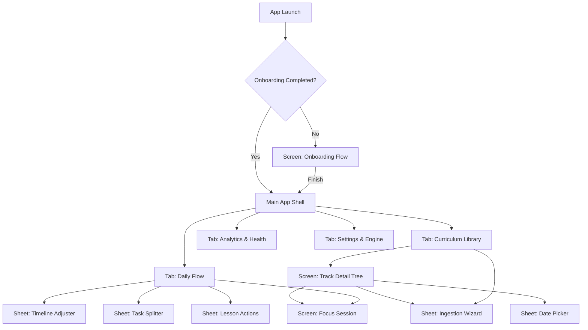

# Rythem: Master UI Page Specification & Interaction Flow

> **Document Type**: Pure UI Information Architecture, Page Breakdown & Interaction Flow  
> **Audience**: UI/UX Designers & Product Architects  
> **Rule**: Contains **zero visual styling, color, or layout prescriptions**. Focuses 100% on **what is on each page, what actions happen, what triggers what screen, and how data changes upon interaction**.

---

## 1. Global Sitemap & Navigation Architecture



---

## 2. Screen 1: First-Time Onboarding Flow

### Purpose
Collects user availability and introduces the pacing model before entering the main app. Shown only on initial app launch.

### What Is on This Screen
1. **Welcome Introduction**: Short explanation of autonomous pacing and zero-backlog study.
2. **Study Intensity Selector**: Options for daily study targets (e.g., Casual = 30m/day, Balanced = 60m/day, Intensive = 120m/day).
3. **Preferred Study Days Selector**: 7 selectable days (Monday through Sunday) indicating which days the user plans to study.
4. **Primary Action Button**: "Get Started" / "Continue".

### Interaction & Flow
- User selects intensity and active days.
- User taps "Get Started".
- **Result**: Preferences are saved to local database; onboarding flag is marked `true`; app immediately transitions into the **Main Shell (Daily Flow Tab)**.

---

## 3. Screen 2: Daily Flow (Home Screen)

### Purpose
The primary daily workspace. Answers: *"What do I study today, what is my speed, and what needs revision?"*

### Information & Components on This Screen
1. **Top Bar**:
   - App branding / title.
   - Track Switcher: Shows active track name with total enrolled track count.
   - Quick Action: Direct link to Settings or Sync status.
2. **Current Week & Streak Tracker**:
   - Shows Monday to Sunday for the active week.
   - Indicates which days had completed study sessions.
   - Highlights the current day ("Today").
   - Shows active streak count (number of consecutive active days).
3. **Pacing Velocity Status (Rhythm HUD)**:
   - **Summary State**:
     - Status tag: `ON TRACK`, `PACE ADAPTED`, or `OPEN PACE`.
     - Required daily commitment (e.g., "45 mins / day").
     - Days remaining until deadline.
   - **Expanded State (upon tap)**:
     - Target Deadline Date vs. Predicted Finish Date.
     - Required Velocity vs. Actual 7-Day Velocity.
     - Quick Action Button: "Adjust Deadline / Pace".
4. **Spaced Repetition Shelf (Daily Revision Board)**:
   - Visible only when topics are due for review.
   - Shows list of topics due today.
   - For each item: Topic title, origin track, interval stage (`Day 1`, `Day 3`, `Day 7`, `Day 14`, `Day 30`).
   - Actions per item: `Mark Revised` button, `Reschedule` button, `Dismiss / Unshelf` button.
5. **Track Filter Selector**:
   - Horizontal filter: "All Tracks" option + chips for each enrolled track.
6. **Curriculum Task List (Chapters & Lessons)**:
   - Renders the active track(s) unabridged.
   - Grouped by Chapter headers (Chapter title, lesson count, progress).
   - Lesson rows:
     - Completion checkbox / toggle.
     - Lesson title.
     - Multi-part indicator (e.g., "Part 1 of 2") if split.
     - Duration label (e.g., "18 mins").
     - Confusing / priority flag (if marked).
     - External link icon (if URL attached).
     - 3-dot / More options trigger.
7. **Empty State (when 0 tracks exist)**:
   - Explanatory graphic/text prompting to add a track.
   - Action Button: "Add First Track" (opens Ingestion Wizard).

### How Interactions Work on This Screen
- **Tapping Lesson Checkbox**:
  1. Checkbox instantly toggles to completed state.
  2. Local database records completion timestamp.
  3. Streak tracker marks today active (streak counter increments if today was not active yet).
  4. Moving velocity and predicted finish date recalculate immediately.
  5. The completed lesson enters the Spaced Repetition queue (due in 24 hours).
- **Tapping Lesson Body**:
  - Opens **Screen 6: Focus Session** for that lesson.
- **Tapping Lesson 3-Dot / Long Press**:
  - Opens **Lesson Action Sheet** (options: Split Task, Mark Confusing, Delay, Edit Notes).
- **Swiping Week Calendar Left/Right**:
  - Pages back to past weeks or forward to current week.
  - A "Today" button appears when viewing past weeks; tapping it snaps back to current week.
- **Tapping "Mark Revised" on Spaced Repetition Card**:
  - Item animates off the shelf; interval tier advances to the next tier (e.g., Day 3 -> Day 7).
- **Tapping Pacing Status HUD**:
  - Expands to show detailed velocity telemetry or launches **Timeline Adjuster Sheet**.

---

## 4. Screen 3: Curriculum Library (Explore Screen)

### Purpose
High-level management of all learning tracks, curriculum discovery, and manual track creation.

### Information & Components on This Screen
1. **Search Bar**: Text field searching across track titles, chapters, and individual lessons.
2. **"New Track" Trigger**: Primary button/icon to launch the Ingestion Wizard.
3. **Track Cards List**:
   - For each track:
     - Track Title.
     - Subject category badge (e.g., "COMPUTER SCIENCE", "BACKEND").
     - Completion count and total lessons (e.g., "14 of 48 beats").
     - Progress bar and percentage.
     - Estimated remaining study hours.
     - Delete / Archive action.
4. **Empty State**: Shown when search yields no results or no tracks exist.

### How Interactions Work on This Screen
- **Tapping Search Bar**: Typing filters track cards and shows matched lessons.
- **Tapping "New Track"**: Opens **Screen 4: Ingestion Wizard**.
- **Tapping a Track Card**: Navigates to **Screen 5: Track Detail Screen**.
- **Tapping Delete on Track Card**: Triggers confirmation prompt -> on confirm, permanently removes track, chapters, and completion logs from SQLite -> list updates.

---

## 5. Screen 4: Ingestion Wizard (Modal / Sheet)

### Purpose
Imports external curricula (YouTube playlists, college syllabi, or raw markdown) and configures track goals.

### Information & Components on This Screen
1. **Source Type Switcher**:
   - Option A: "YouTube Playlist".
   - Option B: "Syllabus / Markdown Outline".
   - Option C: "Manual Blank Track".
2. **Input Area**:
   - Text input field (for pasting playlist link or typing syllabus text).
   - "Paste from Clipboard" quick button.
3. **Parsed Preview Card (appears after link is entered)**:
   - Course title (editable).
   - Total detected videos / topics.
   - Calculated total course duration (e.g., "38 hours 40 mins").
   - Module / Chapter breakdown preview.
4. **Target Goal Configuration**:
   - Start Date Selector (defaults to Today).
   - Target Deadline Date Selector (optional).
   - "Open Pace" toggle (self-paced without a target deadline).
5. **Real-Time Pacing Preview**:
   - Dynamic message updating based on selected deadline: *"To finish by [Date], you will need ~[X] mins/day across your study days."*
6. **Primary Action**: "Create Track" / "Start Learning".

### How Interactions Work on This Screen
- User pastes YouTube playlist link.
- System automatically parses metadata in the background; preview card appears within 1–2 seconds.
- User taps "Target Deadline" -> Opens **Date Picker Sheet** -> User picks date.
- Pacing engine immediately displays required minutes/day.
- User taps "Create Track" -> All chapters and lessons are committed to local database -> Modal closes -> Navigates to the newly created track in **Track Detail Screen**.

---

## 6. Screen 5: Track Detail Screen (Curriculum Tree)

### Purpose
Full structural view of a single curriculum track. Allows browsing chapters, inspecting lessons, resolving ambiguous matches, and editing track settings.

### Information & Components on This Screen
1. **Track Header Banner**:
   - Track title, category, start date, target deadline.
   - Overall progress bar and percentage.
   - Pacing status tag (`On Track` / `Pace Adapted`).
   - Context Menu: Edit Track Dates, Re-sync Playlist, Export Backup, Delete Track.
2. **Chapter Accordion List**:
   - Expandable/collapsible chapter cards.
   - Header shows: Chapter title, completed/total lesson ratio, chapter duration.
   - Inside Chapter:
     - List of all lesson rows with completion toggles, durations, and part badges.
     - "Add Lesson" button inside chapter.
3. **Ambiguous Match Notification Card (conditional)**:
   - Appears inside a chapter if the ingestion algorithm found a video whose title did not cleanly match the syllabus topic.
   - Displays suggested pairing: *"Match video [Title A] with topic [Topic B]?"*
   - Actions: "Confirm Match" button | "Reject Match" button.
4. **Bottom / Floating Action**: "Add Chapter" button.

### How Interactions Work on This Screen
- **Tapping Chapter Header**: Accordion expands or collapses.
- **Tapping Lesson**: Opens **Screen 6: Focus Session** for that lesson.
- **Tapping Lesson Checkbox**: Marks lesson complete/incomplete; progress bar and chapter counts update instantly.
- **Tapping "Confirm Match"**: Binds video URL and duration to the syllabus topic; ambiguity card dismisses.
- **Tapping "Reject Match"**: Unlinks video; leaves topic as an unlinked reading topic.
- **Tapping "Add Chapter" / "Add Lesson"**: Opens contextual text input sheet to create manual entries.

---

## 7. Screen 6: Focus Session (Study Workspace)

### Purpose
Distraction-free environment where the user engages with a specific lesson.

### Information & Components on This Screen
1. **Navigation Header**:
   - Back button (returns to previous screen).
   - Track title and Chapter breadcrumb.
2. **Lesson Content Area**:
   - Current Lesson Title.
   - Duration badge.
   - External Resource Launcher (button to open video in YouTube app or web browser).
3. **Study Timer / Stopwatch**:
   - Digital time display (00:00).
   - Play / Pause / Reset controls.
4. **Personal Notes Field**:
   - Multiline markdown text editor for key takeaways, formulas, or summaries.
   - Auto-saves on edit.
5. **Session Control Actions**:
   - "Previous Lesson" button.
   - "Next Lesson" button.
   - Primary "Mark Complete & Next" button.
   - Context tools: "Split Lesson", "Mark as Confusing".

### How Interactions Work on This Screen
- **Tapping Play on Timer**: Timer counts up/down, tracking study duration.
- **Tapping Resource Launcher**: Launches YouTube app or browser directly to video timestamp.
- **Tapping "Mark Complete & Next"**:
  1. Marks current beat complete and logs elapsed timer minutes.
  2. Spaced repetition item is scheduled.
  3. Screen content smoothly transitions to the next sequential lesson in the chapter.
- **Tapping "Split Lesson"**: Opens **Task Splitter Sheet** to divide lecture into Part 1 / Part 2.

---

## 8. Screen 7: Analytics & Health Screen

### Purpose
Provides long-term visibility into velocity, study consistency, and subject balance.

### Information & Components on This Screen
1. **Time Range Filter**: "This Week", "This Month", "All Time".
2. **Core Velocity KPIs**:
   - Total Study Hours logged.
   - Weekly Velocity Index (average lessons completed per week).
   - On-Time Probability percentage (confidence score of hitting deadlines).
3. **7-Day Study Intensity Chart**:
   - Bar chart displaying study minutes across Monday through Sunday.
   - Shows user's target daily budget line vs. actual minutes logged.
4. **Subject Balance Distribution**:
   - Breakdown of study time spent across different enrolled tracks (e.g., 55% DSA, 30% Backend, 15% System Design).
5. **Memory Retention Statistics**:
   - Total items currently on the Spaced Repetition shelf.
   - Items successfully graduated to long-term memory (Day 30 tier).

### How Interactions Work on This Screen
- **Tapping Time Range Filter**: Recalculates charts and KPIs for the selected timeframe.
- **Tapping a Bar in Intensity Chart**: Displays tooltip with exact minutes studied and lessons completed on that day.

---

## 9. Screen 8: Settings & Engine Management

### Purpose
System configuration, offline AI models, backup storage, and intensity schedule.

### Information & Components on This Screen
1. **Appearance Settings**:
   - Segmented toggle: `System`, `Dark`, `Light`.
2. **7-Day Study Intensity Schedule**:
   - 7 independent sliders/inputs (one for each day Monday–Sunday).
   - Sets how many minutes the user intends to study on each specific day of the week.
3. **Local On-Device AI Manager**:
   - Model options:
     - Compact Tier (0.5B parameters) - Fast keyword and syllabus extraction.
     - Balanced Tier (1.5B parameters) - Deep contextual gap analysis.
   - Status per model: `Not Installed`, `Downloading [Progress Bar + %]`, `Installed [Storage Size]`.
   - Actions: `Download`, `Pause`, `Cancel`, `Delete Model`.
4. **Local Backup & Recovery**:
   - "Export Backup" button (triggers file save dialog for SQLite/JSON bundle).
   - "Restore Backup" button (opens file picker to restore database).
   - Auto-Backup Frequency dropdown: `Daily`, `Weekly`, `On Track Complete`, `Disabled`.
   - Storage Directory picker: Custom location for local backups.
5. **In-App Software Updater**:
   - Displays current installed version string (e.g., `v1.0.2`).
   - "Check for Updates" button.
   - If update available: Displays release notes and "Install Update" button.

### How Interactions Work on This Screen
- **Changing Appearance**: Instantly updates app brightness mode without reloading or restarting.
- **Adjusting Day Sliders**: Updates daily target minutes in database; GPS pacing engine immediately recalculates daily velocity across all active tracks.
- **Tapping Download AI Model**: Starts background HTTP download stream; progress bar updates in real time; pause/cancel controls become active.
- **Tapping Export Backup**: Exports full database snapshot to local file storage and displays confirmation toast.

---

## 10. Contextual Sheets & Overlays (Modals)

These components appear on top of primary screens to handle specific decisions.

| Component | Triggered From | What Is on It | Actions / User Outcome |
| :--- | :--- | :--- | :--- |
| **`Date Picker Sheet`** | Ingestion Wizard, Track Settings, Timeline Adjuster | Month/Year selector, quick presets (`Today`, `+1 W`, `+2 W`, `+1 M`, `+3 M`), calendar day grid | User selects date -> returns selected date to calling view. |
| **`Timeline Adjuster Sheet`** | Pacing HUD on Flow, Track Detail Screen | Target deadline date, slider to shift finish date, live recalculation of required minutes/day | User drags slider -> daily minutes update live -> tapping "Save" updates track deadline. |
| **`Lesson Action Sheet`** | 3-dot menu or long-press on any lesson row | Action list: "Split Lesson", "Mark as Confusing", "Delay Lesson", "Edit Notes", "Copy Link" | User taps action -> triggers corresponding modal or state change. |
| **`Task Splitter Sheet`** | Lesson Action Sheet, Focus Session | Lesson title, total duration, part count selector (2, 3, or 4 parts), part titles preview | User selects part count -> commits split -> original beat becomes `Part 1`, new beats created for remaining parts. |
| **`Backlog Recovery Sheet`** | Pacing HUD when user is behind schedule | Explanation of missed time, Choice A: *"Add [X] mins/day to keep deadline"*, Choice B: *"Glide deadline by [Y] days at current pace"* | User selects Choice A or B -> Pacing budget updates -> status returns to `On Track`. |
| **`Confusing Lesson Dialog`** | Focus Session, Lesson Action Sheet | Prompt: *"Schedule this lesson for priority revision?"*, checkbox to also split into sub-tasks | User confirms -> lesson is tagged confusing and scheduled on Spaced Repetition shelf for tomorrow. |

---

## 11. State Transition Matrix

Understanding how the system moves between states is essential for screen design:

```
[Day 0: No Tracks]
       │
       ▼ (User imports YouTube playlist)
[Track Active: On Track]
       │
       ├─── (User misses 3 study days) ─────────► [Pace Adapted / Behind Schedule]
       │                                                      │
       │                                                      ▼ (User taps recovery option)
       │◄──────────────────────────────────────── [Recalculated: On Track]
       │
       ├─── (User completes daily quota) ────────► [Today's Goal Met]
       │
       └─── (User completes all chapters) ──────► [Track 100% Mastered]
```

---

*This document defines the complete functional flow and page specification for Rythem. The designer may assemble these requirements into any page layout, visual style, or interaction pattern.*
