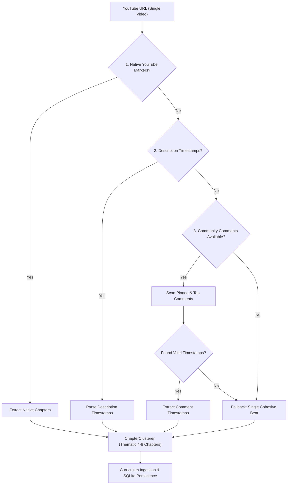

# Feature 6 Implementation Plan: YouTube Timestamps & Community Comments Chapter Extraction

> **Goal**: Enable learners to study long single-video crash courses (e.g. 4-hour to 12-hour masterclasses) by automatically extracting structured chapters from video descriptions, native chapter markers, or pinned and top community comments when descriptions lack timestamps, clustering them into cohesive, bite-sized daily beats.

---

## 1. Architectural Philosophy & Invariants

1. **Zero-Drop & Accurate Timestamp Extraction**:
   - When ingesting a long video, the system extracts the full sequence of topics with their exact start offsets (`&t=Xs`) and calculated durations.
   - 100% video coverage: Zero seconds dropped; each topic lasts from its start timestamp until the next timestamp (or video end).
2. **Multi-Tier Chapter Extraction Hierarchy**:
   1. **Tier 1 (Native Chapters)**: Direct Innertube `next` endpoint `macroMarkersListItemRenderer` / `chapterRenderer`.
   2. **Tier 2 (Description Timestamps)**: Structured timestamps in video description.
   3. **Tier 3 (Community Comments Fallback)**:
      - When Tiers 1 & 2 yield no chapters, fetch video comments.
      - Inspect **pinned comments** and **top-liked comments** (where community members or creators often post timecodes).
      - Select the best comment containing $\ge 2$ chronological timestamps.
   4. **Tier 4 (Single Video Fallback)**: If no timestamps exist anywhere, fall back gracefully to a single cohesive beat.
3. **Mid-Topic Split Prevention & Thematic Cohesion**:
   - Use `ChapterClusterer` to group timestamped beats into 4–8 logical modules (chapters) based on topic semantics or balanced duration blocks, avoiding single endless chapters or fragmented 1-minute beats.

---

## 2. Technical Design & Pipeline

---

## 3. Proposed Changes

### A. Parser Enhancements
#### `lib/core/ingestion/parsers/timestamp_parser.dart`
- Enhance `_timestampPattern` to support timestamps at both start and end of line:
  - Supports `00:00 Introduction`, `1. Introduction - 00:00`, `[01:23] Theory`, `(12:45) Practice`.
- Add `parseComments(List<String> commentTexts, {int totalVideoDurationSeconds = 0, int minSegments = 2})`:
  - Iterates through comments (ordered by relevance/priority).
  - Sanitizes comment text (strips greetings like *"Timestamps below:"*, *"Hope this helps:"*, emojis, and bullet marks).
  - Evaluates candidate segment quality: requires chronological progression and returns the highest-quality segment list.

---

### B. Extractor Service Updates
#### `lib/core/ingestion/services/youtube_extractor_service.dart`
- Add `Future<ExtractedResource?> _extractVideoViaComments(String videoId, ...)`:
  - Fetches comments via `_yt.videos.commentsClient.getComments(videoId)`.
  - Fallback to Innertube `next` comment continuation tokens if direct API is blocked.
  - Prioritizes:
    1. Pinned comment / Creator-hearted comment.
    2. Highest like count comments.
  - Runs `TimestampParser.parseDescription` or `parseComments`.
  - If valid segments found ($\ge 2$), builds `RawResourceItem` list with `$videoUrl&t=${seg.startSeconds}s`.
  - Tags resource type as `ExtractedResourceType.singleVideoWithTimestamps`.
- Integrate `_extractVideoViaComments` into the `extractVideo` pipeline between Tier 4 (HTML) and Tier 5 (single-beat fallback).

---

### C. Chapter Clustering & Ingestion
#### `lib/core/ingestion/parsers/chapter_clusterer.dart`
- Ensure timestamped beats from a single long video are clustered into balanced modules:
  - Group beats by shared section prefixes if present (e.g. *"Phase 1: Foundations"*, *"Phase 2: Advanced Concepts"*).
  - Otherwise, partition evenly into 4–8 chapters based on duration and beat count.
- Prevent single micro-beats from creating 1-beat orphan chapters.

---

## 4. Verification & Testing Plan

1. **Unit Tests** (`test/comment_timestamp_extraction_test.dart`):
   - Parsing timestamps positioned at line starts (`00:00 Intro`).
   - Parsing timestamps positioned at line ends (`Intro - 00:00`).
   - Sanitizing commentary conversational preambles (*"I made timestamps for everyone: 0:00 Intro..."*).
   - Selecting pinned/hearted comment over arbitrary comments.
2. **Service Tests**:
   - `YoutubeExtractorService.extractVideo` falls back to community comments when description lacks timestamps.
   - Segments retain correct start seconds, duration calculations, and deep-link query parameters (`&t=Xs`).
3. **End-to-End Ingestion Tests**:
   - Ingesting a single video with comment timestamps via `CurriculumIngestionService` creates a roadmap with structured chapters and timestamped beats in SQLite.
4. **Full Regression & Static Analysis**:
   - Run `flutter analyze` (must pass with 0 issues).
   - Run `flutter test` (all 187+ existing and new tests must pass).
